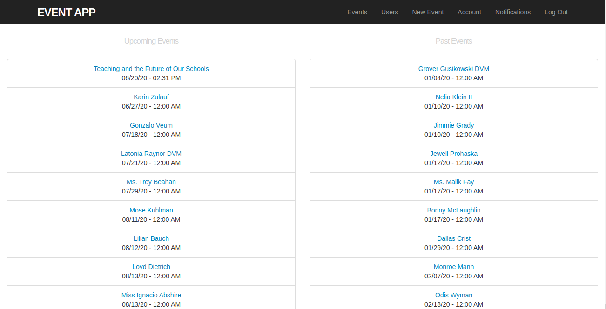

<br />
<p align="center">
  <h1 align="center"> Private Events </h1>

  <p align="center">
    A Ruby on Rails application
    <br />
    <br />
    <a href="https://stormy-ravine-81598.herokuapp.com/">View Demo</a>
    ·
    <a href="https://github.com/kobiyoyo/PRIVATE-EVENTS/issues">Report Bug</a>
    ·
    <a href="https://github.com/kobiyoyo/PRIVATE-EVENTS/issues">Request Feature</a>
  </p>
  
</p>


Private Events app is aimed at  building a clone  version of Eventbrite, which allows users to create events and manage user signups. Users can create events and attend them. Events take place at a specific date and at a location. Only signed up user can create events. A user can attend many events and an event can be attended by many users.

The project is part of a series of projects to be completed by students of [Microverse](https://www.microverse.org/ "The Global School for Remote Software Developers!").


## Built With
- Ruby 
- Ruby on Rails
- Bootstrap 4
- Rubocop
- PostgreSQL

## Features
- A user can signup/login
- A user can create, delete, edit events.

## Future features
* User can Create a timer for each event.
* Logout after 5 minutes of inactivity


## Environment
- Ruby on Rails version 6.0
- [Bootstrap-sass](https://www.rubydoc.info/gems/bootstrap-sass/3.3.6) is a Sass-powered version of Bootstrap 3, ready to drop right into your Sass powered applications version 3.3.7
- Puma: A Ruby Web Server Built For Concurrency version '3.9.1'

## Getting started
> To get started with the app, clone the repo and then install the needed gems:

```
$ bundle install --without production
```

> Next,create & migrate the database:
```
$ rails db:create

$ rails db:migrate
```

> Run the app in a local server:

```
$ rails server
```
> Finally, run the test suite to verify that everything is working correctly:

```
$ rspec
```
> You can then drop into rails console to explore the models

```sh
$  rails c
```

## Contributors

* [Adama Chubiyojo Desmond](https://github.com/kobiyoyo)[(Email)](mailto:Adamachubi@gmail.com)

* [Danilo Zagarcanin ](https://github.com/danilozag1992)[(Email)](mailto:danilozagarcanin@gmail.com)

## Contributing

1. Fork it (https://github.com/danilozag1992/PRIVATE-EVENTS//fork)
2. Create your feature branch (git checkout -b feature/[choose-a-name])
3. Commit your changes (git commit -am 'what this commit will fix/add')
4. Push to the branch (git push origin feature/[chosen-name])
5. Create a new Pull Request

## License

This project is licensed under the MIT License - see the [LICENSE](./LICENSE) file for details
 


